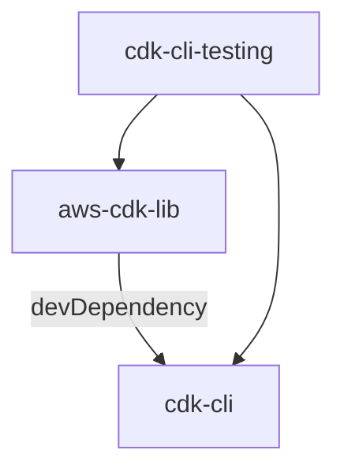

# AWS CDK CLI Testing

This repository contains the integration tests of the AWS CDK CLI repository.

They are extracted to a separate repository because there is a dependency between our 3 different repos:



## Usage

```sh
$ bin/run-suite \
  --use-cli-release=2.175.0 \
  --verbose \
  cli-integ-tests",
``` 
